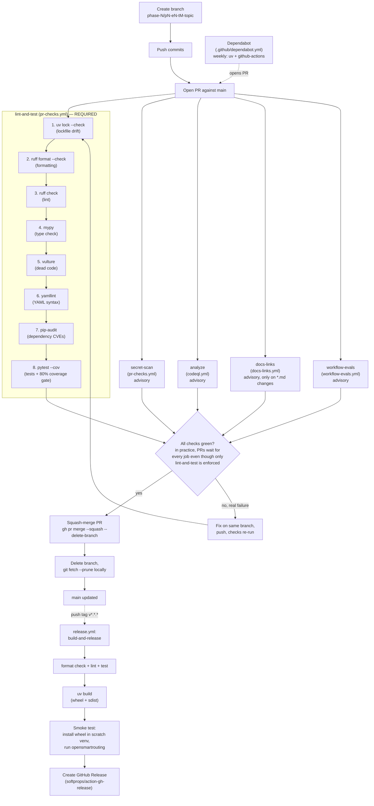

# CI/CD Pipeline

> How code moves from a local branch to `main` and, eventually, to a release. For *why* each
> check exists (and what is deliberately deferred), see `docs/guide/quality-gates.md` — this
> doc is the *how/when*, not the *why*.

## Diagram

## Triggers, by workflow file

| Workflow file | Job(s) | Triggers | Required for merge? |
|---|---|---|---|
| `pr-checks.yml` | `lint-and-test` | PR → `main` | **Yes** (branch protection) |
| `pr-checks.yml` | `secret-scan` | PR → `main` | No (advisory; always waited on in practice) |
| `codeql.yml` | `analyze` | PR → `main`, push → `main`, weekly cron (Mon 06:00 UTC) | No (advisory) |
| `docs-links.yml` | `docs-links` | PR → `main`, only when `**/*.md`, `.lychee.toml`, or the workflow file itself changes | No (advisory; path-filtered) |
| `workflow-evals.yml` | `workflow-evals` | PR → `main`, push → `main`, manual `workflow_dispatch` | No (advisory) |
| `release.yml` | `build-and-release` | push of a tag matching `v*.*.*` | N/A — not a PR gate, runs on tag push |

Only `lint-and-test` is a **required status check** in GitHub branch protection on `main`
(`gh api repos/.../branches/main/protection` → `required_status_checks.contexts: ["lint-and-test"]`).
The other jobs run on every PR and are checked manually before merging (this session's convention),
but a merge is not structurally blocked if one of them is still pending or red.

## What each job actually checks

### `lint-and-test` (required)

Runs in order, failing fast on the first non-zero exit:

1. `uv lock --check` — lockfile drift check (P0-E0-T20): fails if `uv.lock` is out of sync with `pyproject.toml`.
2. `uv sync` — installs the project and dev dependencies.
3. `uv run ruff format --check .` — formatting (P0-E0-T2).
4. `uv run ruff check .` — linting (P0-E0-T2).
5. `uv run mypy` — type checking (P0-E0-T12).
6. `uv run vulture src tests` — dead code detection (P0-E0-T18).
7. `uv run yamllint harmonic-custom/config.yml .github` — YAML syntax/schema lint (P0-E0-T23).
8. `uv run pip-audit` — dependency vulnerability scan (P0-E0-T13).
9. `uv run pytest --cov=... --cov-report=term-missing --cov-report=html` — unit tests with a
   coverage threshold gate (`fail_under = 80` in `pyproject.toml`, P0-E0-T9 / P0-E0-T19). Coverage
   HTML report is uploaded as a build artifact.

This is the same sequence as local `make check` (see `Makefile`), so a green `make check` locally
should mean a green `lint-and-test` in CI.

### `secret-scan`

Runs `gitleaks/gitleaks-action@v3` against the PR's full commit range (`fetch-depth: 0`) as a CI
backup to GitHub's native secret scanning + push protection (P0-E0-T15 / P0-E0-T16). Note: it scans
the whole commit range, not just the final diff — a secret introduced and later deleted in the same
PR still fails the check until the offending commit is removed from history.

### `analyze` (CodeQL)

Static analysis for Python via `github/codeql-action` (P0-E0-T17). Runs on every PR, every push to
`main`, and weekly on a schedule to catch newly published CodeQL query updates even without new
code changes.

### `docs-links`

Runs `lycheeverse/lychee-action` against `README.md`, `CONTRIBUTING.md`, `CHANGELOG.md`, and
`docs/**/*.md` (P0-E0-T22), configured via `.lychee.toml`. Only triggers when Markdown files (or its
own config/workflow) change, to avoid slowing down unrelated PRs.

### `workflow-evals`

Runs `tools/eval_workflows.py` against `ai-evals/workflow-contracts.json` to validate the repo's
own prompt/workflow files stay internally consistent. Predates the quality-gate ticket batch
(T12–T23) but is part of the same PR-checks layer.

### `build-and-release` (release workflow)

Not a PR gate — triggers on pushing a `v*.*.*` tag (P0-E0-T11). Re-runs format/lint/test, builds
the wheel and sdist with `uv build`, smoke-tests the built wheel in a scratch venv by installing it
and running the `opensmartrouting` CLI (P0-E0-T21), then creates a GitHub Release with the built
artifacts attached.

### Dependabot

`.github/dependabot.yml` (P0-E0-T14) opens PRs weekly for `uv` dependency updates and GitHub Actions
version bumps. These PRs go through the same `lint-and-test`/`secret-scan`/`analyze`/`docs-links`
checks as any other PR before merging.

## Keeping this doc accurate

This file only has value if it matches the actual workflow YAML. When adding, removing, or
retriggering a workflow file or job, update this doc (diagram + table) in the same PR.
